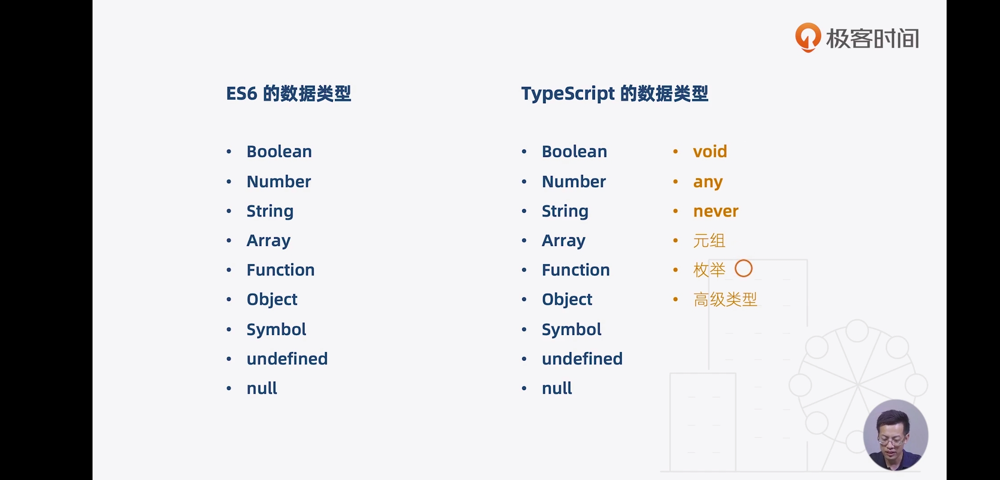

# JavaScript
## 1. 变量类型
数字
字符串
true
null
undefined




## 2. 其他


#javascript#

# Usage_node 
## 1. 配置国内淘宝registry

```
npm config set registry http://registry.npm.taobao.org/
```

 在Linux ~/.npmrc
```
registry=http://registry.npm.taobao.org/
```

## 2. npm 升级 

```shell
npm install -g npm --registry=https://registry.npm.taobao.org
```


## 3. Termux安装nodejs

```shell
pkg install nodejs
```

# VUE
1. 插值表达式 {{}}
2. v-text   v-html
3. v-on:click="函数名"  => @click=""
4. 属性绑定 v-bind: 属性='' => :属性=""
    string 拼接bruce  " data +'bruce'"
5. 双向绑定 v-model=""
6. 计算属性 
        computed 是一个函数 通过cli建的
        如果是直接实例
```
        new Vue()
        {
            computed: {
                 xxx: function() {
                      return this.x + this.y
                 }
            }

        }
```


7. 侦听器 watch
```
         watch: {
              x: function() {
              }
         }
```

8. v-if    v-show     ='show'  show是true，false

9. v-for='item of xxList' :key=''

10. 全局组件 
```
     Vue.component('xxx_name', {
            template: ''
       })
```

      局部组件 var xxx_name = {}
      需要在外层Vue实例里 添加
```
          components: {
              'todo-item': xxx_name
          }
```
11. 父子组件传值
     1)在父组件 bind 某个值
        在子组件 用 props属性里传过来
     2) 子组件要删除某个，需要传到父组件里
          发布订阅模式
          需要在子组件里写一个方法:
          向外触发xxx_事件， 在父组件监听此事件    @xxx_事件
          this.$emit('xxx_事件', 属性)
12. 挂载点下面 都是模板， 模板里可以用组件


13.  通过cli创建的
      组件里 
```
      <script>
         export default {
           data: function() {
               return { 
                     xxx
               }
           }
         }
     </script>
```
     在ES6中可以简写成 data () {}

#vue#
# export default
node中导入模块：var 名称 = require('模块标识符')

node中向外暴露成员的形式：module.exports = {}

在ES6中，也通过规范的形式，规定了ES6中如何导入和导出模块

ES6中导入模块，使用 import 模块名称 from '模块标识符'    import '表示路径'

import *** from *** 是ES6中导入模块的方式

在ES6中，使用export default 和 export 向外暴露成员
注意：
// test.js
```
var info = {
    name: 'zs',
    age: 20
}
export default info
 
export var title = '小星星'
 
export var content = '哈哈哈'
```
- - -
```
import person from './test.js'
console.log(person);

import person, {title, content as content1} from './test.js'
console.log(person);
console.log(title + '=======' + content1);
```

1、export default 向外暴露的成员，可以使用任意变量来接收

2、在一个模块中，export default 只允许向外暴露一次

3、在一个模块中，可以同时使用export default 和export 向外暴露成员

4、使用export向外暴露的成员，只能使用{  }的形式来接收，这种形式，叫做【按需导出】

5、export可以向外暴露多个成员，同时，如果某些成员，在import导入时，不需要，可以不在{ }中定义

6、使用export导出的成员，必须严格按照导出时候的名称，来使用{ }按需接收

7、使用export导出的成员，如果想换个变量名称接收，可以使用as来起别名
- - -
export命令对外输出了指定名字的变量（变量也可以是函数或类）。

与export default命令的区别：import命令接受一对大括号，里面指定要从其他模块导入的变量名。大括号里面的变量名，必须与被导入模块（profile.js）对外接口的名称相同。

如果想为输入的变量重新取一个名字，import命令要使用as关键字，将输入的变量重命名。

使用import命令的时候，用户需要知道所要加载的变量名或函数名，否则无法加载。但是，用户肯定希望快速上手，未必愿意阅读文档，去了解模块有哪些属性和方法。

为了给用户提供方便，让他们不用阅读文档就能加载模块，就要用到export default命令，为模块指定默认输出。

#npm#
# Usage_Vue

1. vue create vue-hello-world (命令行)

2.  vue ui (界面)
# NPM_node package

## 1. hexo
npm install hexo-cli -g

```
mkdir hexoblog  #手动创建一个目录
cd hexoblog  
hexo init   #初始化hexo环境
hexo g      #生成静态文件
hexo s      #启动hexo
```

- - -
## 2. http-server
npm install http-server

```
hs -o -p xxx端口
```

- - -
## 3. App 常用 package

```
fastclick
stylus   stylus-loader
vue-awesome-swiper@2.6.7
better-scroll
```


